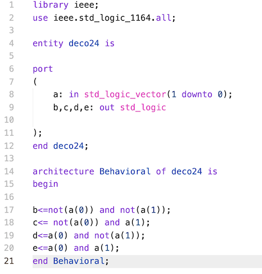

# Repositorio para el laboratorio de Circuitos Lógicos

## Introducción 

Este repositorio contiene las prácticas 4 y 6 del laboratorio, así como los archivos asociados requeridos para su ejecución. 

El contenido de estas prácticas fue elaborado usando Visual Studio Code para programar en VHDL, y los archivos complementarios fueron generados en Quartus Prime. 

## P4 Quartus  

El folder principal para los archivos de la práctica 4. Contiene 4 folders (db, incremental_db, output_files y simulation/modelsim), los cuales no modificaremos, debido a que son archivos de complación de Quartus. Nuestro interés está en los siguientes archivos:  

- circuitoAritmetico.vhd
- componentes.vhd
- deco24.vhd 
- generador.vhd
- multiplexor.vhd
- practica4quartus.vhd

Cada uno de ellos sirve para construir uno de los elementos necesarios para la práctica. El formato es el siguiente: 

