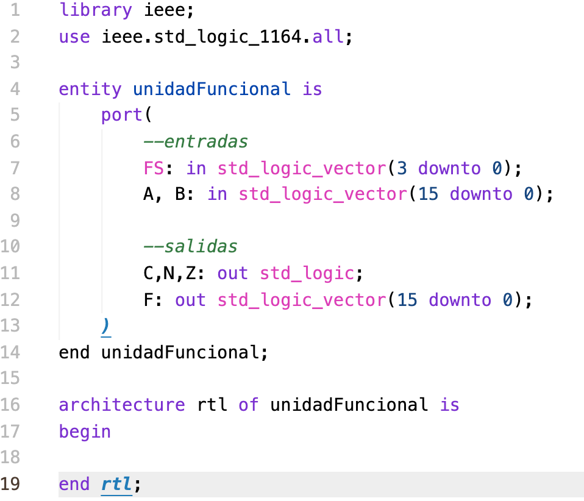
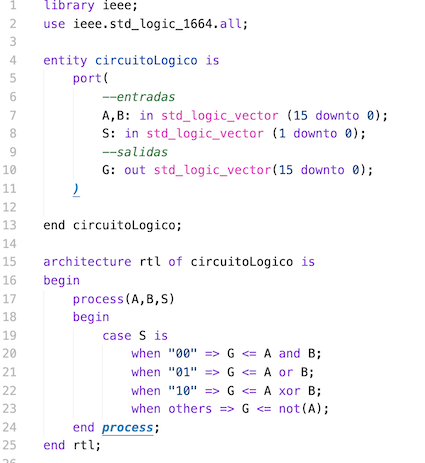

# Repositorio para el laboratorio de Circuitos Lógicos

## Introducción 

Este repositorio contiene las prácticas 4 y 6 del laboratorio, así como los archivos asociados requeridos para su ejecución. 

Los componentes de estas prácticas fueron elaborados usando Visual Studio Code para programar en VHDL; los archivos complementarios fueron generados en Quartus Prime. 

## P4 Quartus  

El folder principal para los archivos de la práctica 4. Contiene 4 folders (db, incremental_db, output_files y simulation/modelsim), los cuales no modificaremos, debido a que son archivos de complación de Quartus. Nuestro interés está en los siguientes archivos:  

- circuitoAritmetico.vhd
- componentes.vhd
- deco24.vhd 
- generador.vhd
- multiplexor.vhd
- practica4quartus.vhd

Cada uno de ellos sirve para construir uno de los elementos necesarios para la práctica. El formato es el siguiente: 

La sección de **port** especifica las entradas y salidas del componente. La sección **architecture** especifica el comportamiento del componente con respecto a ciertas entradas. Cada componente tiene su propia arquitectura, por lo que hay que prestar especial atención a las funciones que realizan. En este caso, se han implementado varios elementos que hemos venido trabajando en prácticas anteriores, como el generador que creamos hace dos semanas. 

## P6 Quartus 

Similar al folder anterior, pero ahora contamos con un único archivo vhdl: la unidad funcional. Tiene la siguiente forma: 

## Circuito Lógico 

Fuera de cualquiera de las carpetas anteriores se encuentra el archivo circuitoLogico.vhd ; tiene la siguiente estructura: 

## Modo de uso

1. Descargar los archivos vhd.
2. Agruparlos de la misma forma en que se encuentran en este repositorio. 
3. Abrir Quartus Prime e importar los archivos vhd como componentes.
4. Compilar y ejecutar en Quartus.

## Adicionales 

Como se menciona anteriormente, cualquier archivo que no sea .vhd **no debe ser modificado**. Esto se debe a que dichos adrchivos contienen los parámetros de compilación que generó Quartus para mi máquina. En caso de querer utilizar estos componentes, se deben importar a Quartus y seguir los pasos para la compilación y asignación de entradas y salidas de hardware (pinout).  
